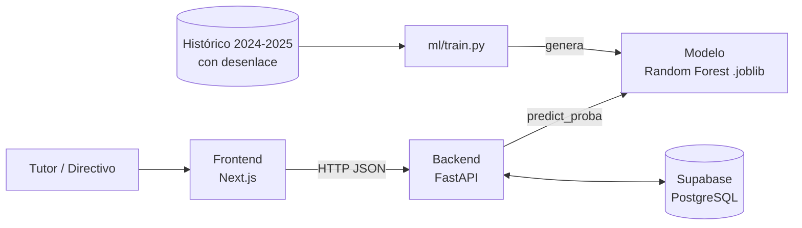
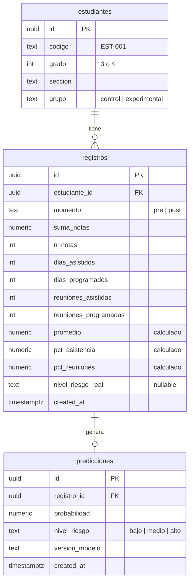

# 🏗️ ARQUITECTURA

La tesis define la web con tres partes: **frontend, backend y base de datos** [26]. A esto se suma el **modelo de ML** como componente del backend.

## Diagrama


## Stack
| Capa | Tecnología | Por qué |
|---|---|---|
| ML | Python 3.11, pandas, scikit-learn, joblib | Declarado en la metodología [35] |
| Estadística | scipy, statsmodels | Shapiro-Wilk, K-S (Lilliefors), t de Student, Mann-Whitney |
| Backend | FastAPI + Uvicorn | Mismo lenguaje que el modelo; carga el `.joblib` sin puentes |
| Base de datos | Supabase (PostgreSQL) | Gestionado, con Auth incluido |
| Frontend | Next.js (App Router) + TypeScript + Tailwind | Dashboard rápido de construir |
| Deploy | Vercel (frontend), Render (backend) | Capas gratuitas suficientes para el piloto |

> Conexión Render → Supabase: usar la cadena del **connection pooler** de Supabase (compatible con IPv4), no la conexión directa.

## Estructura del repositorio
```
riesgo-desercion-web/
├── CLAUDE.md
├── README.md
├── .gitignore
├── docs/                  # esta documentación
├── data/
│   ├── raw/               # ❌ gitignored — exportes originales de la IE
│   ├── processed/         # ❌ gitignored — CSV limpios y anonimizados
│   └── synthetic/         # ✅ versionado — solo para pruebas
├── ml/
│   ├── generate_synthetic.py
│   ├── preprocess.py
│   ├── train.py
│   ├── evaluate.py
│   └── models/            # rf_vN.joblib + rf_vN.json (metadatos)
├── stats/
│   └── analisis.py        # Fase 8 (ver PLAN_ESTADISTICO.md)
├── backend/
│   ├── app/
│   │   ├── main.py
│   │   ├── routers/
│   │   ├── services/      # cálculo de indicadores y predicción
│   │   ├── schemas.py     # modelos Pydantic
│   │   └── db.py
│   └── requirements.txt
└── frontend/
    ├── app/
    ├── components/
    └── lib/api.ts
```

## Modelo de datos (Supabase)

Se guardan los **datos crudos** (días, notas, reuniones) además de los indicadores calculados, para que cada valor sea trazable hasta su ficha.

## Flujo principal
1. El tutor registra (o carga por CSV) los datos crudos de un alumno.
2. El backend valida y calcula los 3 indicadores con las fórmulas de la tesis.
3. El backend pasa los indicadores al modelo → obtiene probabilidad → la convierte en nivel.
4. Se guarda registro + predicción; el dashboard muestra el nivel con color.

## Seguridad y privacidad
- Solo usuarios autenticados (Supabase Auth). Roles: `tutor`, `directivo`.
- Ningún nombre ni DNI en la BD: solo `codigo`. La tabla código ↔ nombre queda **fuera del sistema**, en poder de la IE.
- Variables sensibles en `.env`, nunca en el repo.
