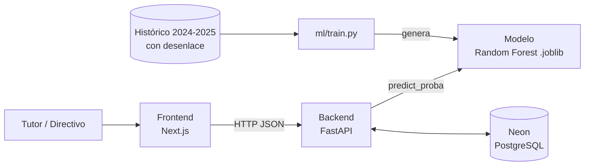
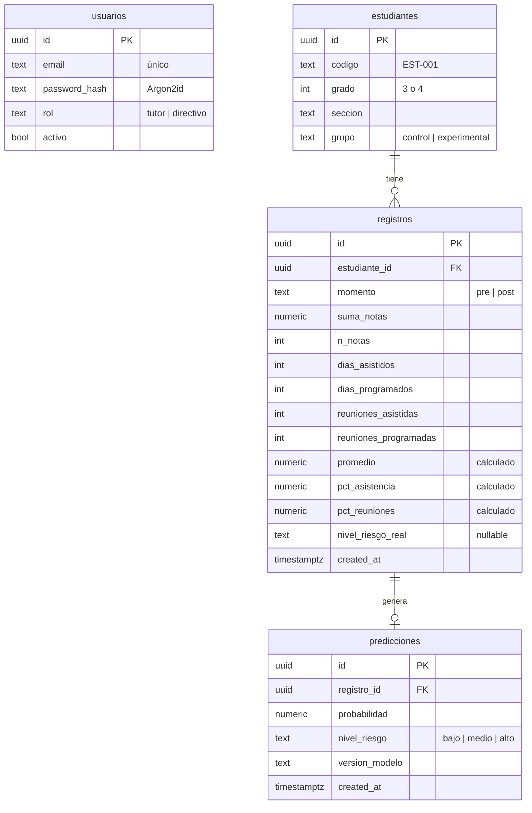

# 🏗️ ARQUITECTURA

La tesis define la web con tres partes: **frontend, backend y base de datos** [26]. A esto se suma el **modelo de ML** como componente del backend.

## Diagrama

```mermaid
flowchart LR
  U[Tutor / Directivo] --> F[Frontend<br/>Next.js]
  F -->|HTTP JSON| B[Backend<br/>FastAPI]
  B -->|predict_proba| M[Modelo<br/>Random Forest .joblib]
  B <--> D[(Neon<br/>PostgreSQL)]
  H[(Histórico 2024-2025<br/>con desenlace)] --> T[ml/train.py]
  T -->|genera| M
```

## Stack
| Capa | Tecnología | Por qué |
|---|---|---|
| ML | Python 3.11, pandas, scikit-learn, joblib | Declarado en la metodología [35] |
| Estadística | scipy, statsmodels | Shapiro-Wilk, K-S (Lilliefors), t de Student, Mann-Whitney |
| Backend | FastAPI + Uvicorn | Mismo lenguaje que el modelo; carga el `.joblib` sin puentes |
| Base de datos | Neon (PostgreSQL) | Gestionado, capa gratuita; decisión D10 (2026-10-10) |
| Autenticación | Propia del backend: Argon2id + JWT (PyJWT) | Sin servicios externos (D10); ver "Seguridad y privacidad" |
| Frontend | Next.js (App Router) + TypeScript + Tailwind | Dashboard rápido de construir |
| Deploy | Vercel (frontend), Render (backend) | Capas gratuitas suficientes para el piloto |

> Conexión Render → Neon: usar la cadena con **connection pooling** (host terminado en `-pooler`) y `sslmode=require`. Neon suspende la base sin uso; la primera consulta tras la pausa tarda unos cientos de ms más.

## Estructura del repositorio
```
web-ml/
├── CLAUDE.md
├── README.md
├── .gitignore
├── docs/                  # esta documentación (planes en docs/planes/)
├── fichas/                # plantillas Excel vacías de las 3 fichas + generar_fichas.py
├── data/
│   ├── raw/               # ❌ gitignored — exportes originales de la IE
│   ├── processed/         # ❌ gitignored — CSV limpios y anonimizados
│   └── synthetic/         # ✅ versionado — solo para pruebas
├── ml/
│   ├── generate_synthetic.py
│   ├── preprocess.py
│   ├── train.py
│   ├── evaluate.py
│   └── models/            # rf_vN.joblib + rf_vN.json (metadatos)
├── stats/
│   └── analisis.py        # Fase 8 (ver PLAN_ESTADISTICO.md)
├── backend/
│   ├── app/
│   │   ├── main.py
│   │   ├── routers/
│   │   ├── services/      # cálculo de indicadores y predicción
│   │   ├── schemas.py     # modelos Pydantic
│   │   └── db.py
│   └── requirements.txt
└── frontend/
    ├── app/
    ├── components/
    └── lib/api.ts
```

## Modelo de datos (Neon)

```mermaid
erDiagram
  usuarios {
    uuid id PK
    text email "único"
    text password_hash "Argon2id"
    text rol "tutor | directivo"
    bool activo
  }
  estudiantes ||--o{ registros : tiene
  registros ||--o| predicciones : genera
  estudiantes {
    uuid id PK
    text codigo "EST-001"
    int grado "3 o 4"
    text seccion
    text grupo "control | experimental"
  }
  registros {
    uuid id PK
    uuid estudiante_id FK
    text momento "pre | post"
    numeric suma_notas
    int n_notas
    int dias_asistidos
    int dias_programados
    int reuniones_asistidas
    int reuniones_programadas
    numeric promedio "calculado"
    numeric pct_asistencia "calculado"
    numeric pct_reuniones "calculado"
    text nivel_riesgo_real "nullable"
    timestamptz created_at
  }
  predicciones {
    uuid id PK
    uuid registro_id FK
    numeric probabilidad
    text nivel_riesgo "bajo | medio | alto"
    text version_modelo
    timestamptz created_at
  }
```
Se guardan los **datos crudos** (días, notas, reuniones) además de los indicadores calculados, para que cada valor sea trazable hasta su ficha.

Restricciones: `codigo` único; un registro por alumno y momento (`unique (estudiante_id, momento)`); una predicción por registro (se actualiza si se vuelven a cargar los datos). Esquema: `backend/sql/001_esquema.sql`; solo el backend se conecta a la base. El modelo que carga el backend es el `RandomForestClassifier` de sklearn (sin el envoltorio de aumento), con la misma versión de scikit-learn que `ml/` (1.9.1).

## Flujo principal
1. El tutor registra (o carga por CSV) los datos crudos de un alumno.
2. El backend valida y calcula los 3 indicadores con las fórmulas de la tesis.
3. El backend pasa los indicadores al modelo → obtiene probabilidad → la convierte en nivel.
4. Se guarda registro + predicción; el dashboard muestra el nivel con color.

## Seguridad y privacidad
- Solo usuarios autenticados, con autenticación propia del backend (D10, `backend/app/auth.py`):
  - Contraseñas guardadas como hash **Argon2id** (nunca en texto plano), mínimo 10 caracteres.
  - Sesión con token **JWT HS256** firmado con `JWT_SECRET` (≥ 32 caracteres), 8 horas de validez.
  - En cada petición se verifica que el usuario siga activo: desactivarlo corta el acceso al momento.
  - 5 intentos fallidos seguidos bloquean el correo 15 minutos; el mensaje de error no revela si el correo existe.
  - Sin registro público: el administrador crea usuarios con `python -m app.crear_usuario`.
  - Roles: `tutor`, `directivo` (`requiere_rol` disponible; por ahora todos los endpoints admiten ambos).
- La web debe servirse por HTTPS (Render y Vercel lo dan por defecto): el token viaja en cada petición.
- Ningún nombre ni DNI en la BD: solo `codigo`. La tabla código ↔ nombre queda **fuera del sistema**, en poder de la IE.
- Variables sensibles en `.env`, nunca en el repo.
